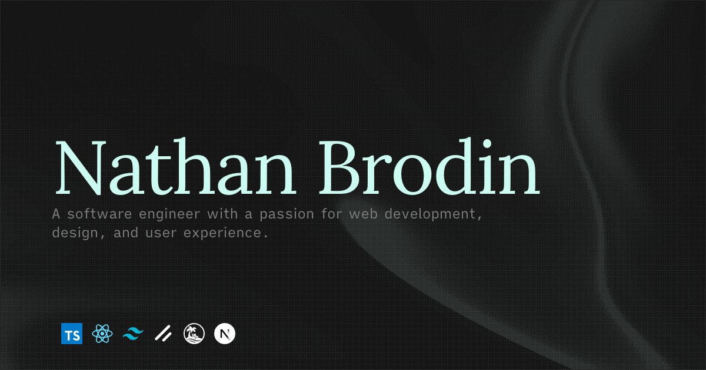

# [Nathan's Portfolio](https://brodin.dev) &middot; [](https://github.com/nathanbrodin/portfolio/blob/main/LICENSE) 

My Portfolio, to showcase my work as a Frontend Engineer.

→ Check out the live site: [brodin.dev](https://brodin.dev)



## Overview

### Stack

- [Vite+](https://viteplus.dev/)
- [React 19 + React Compiler](https://react.dev)
- [Tanstack Start](https://tanstack.com/start/latest)
- [Tailwind CSS](https://tailwindcss.com)
- [Base UI](https://base-ui.com)
- [coss ui](https://coss.com/ui)
- [Content Collections](https://www.content-collections.dev/)
- [Soundcn](https://www.soundcn.xyz/)

### Inspiration

My Portfolio is inspired by:

- [Chanhdai](https://chanhdai.com/), for the components and general layout.
- [Zed](https://zed.dev), for the fonts and general style.

### Features

- Light/Dark themes
- SEO optimized ([JSON-LD schema](https://json-ld.org), sitemap, robots)
- Markdown Content
- Perfect Lighthouse Score
- Blog Section
- llms.txt
- RSS Feed
- Sound design
- OG Image generation

## Getting Started

### Prerequisites

Ensure you have the following installed on your local machine:

- **[Node.js](https://nodejs.org/)**
- **[Git](https://git-scm.com/)**
- **[pnpm](https://pnpm.io/)**
- **[Vite+ CLI](https://viteplus.dev/guide/)** _(Note: Vite+ acts as the package manager for this project)._

### Installation & Setup

**1. Clone the repository**

```bash
git clone [https://github.com/NathanBrodin/Portfolio.git](https://github.com/NathanBrodin/Portfolio.git)
cd Portfolio
```

**2. Set up environment variables**
To fetch your GitHub data, you'll need a personal access token.

- Go to [GitHub Token Settings](https://github.com/settings/tokens/new) and generate a new token with the `public_repo` scope.
- Create an `.env.local` file in the root of the project and add your token:

```env
GITHUB_API_TOKEN="YOUR_TOKEN"
```

**3. Install dependencies and run**

```bash
vp install
vp dev
```

> The application should now be running at [http://localhost:3000](http://localhost:3000)

---

## Development Commands

This project uses **Vite+**, a unified toolchain built on top of Vite, Rolldown, Vitest, tsdown, Oxlint, Oxfmt, and Vite Task.

| Command           | Action                                        |
| :---------------- | :-------------------------------------------- |
| `vp dev`          | Starts the local development server           |
| `vp build`        | Builds the application for production         |
| `vp preview`      | Previews the local production build           |
| `vp check`        | Runs format, lint, and TypeScript type checks |
| `vp test`         | Runs the test suite                           |
| `vp add <pkg>`    | Adds a package to dependencies                |
| `vp remove <pkg>` | Removes a package from dependencies           |
| `vp update`       | Updates packages to their latest versions     |

## Star History

[](https://starchart.cc/NathanBrodin/Portfolio)
